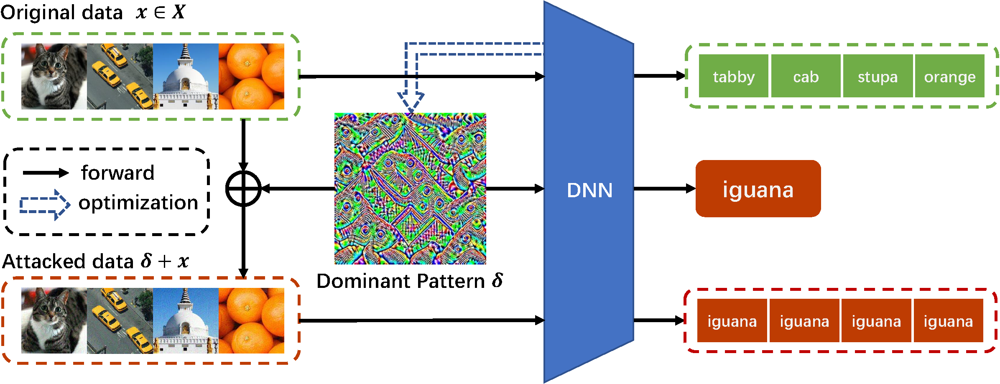

# Dominant Patterns: Critical Features Hidden in Deep Neural Networks

 This is the code for the experiments of our paper. You can find the arXiv version of the paper here: https://arxiv.org/pdf/2105.15057



## Citation

```bib
@article{ye2021dominant,
  title={Dominant Patterns: Critical Features Hidden in Deep Neural Networks},
  author={Ye, Zhixing and Qin, Shaofei and Chen, Sizhe and Huang, Xiaolin},
  journal={arXiv preprint arXiv:2105.15057},
  year={2021}
}
```


## Building Environment

### Package

You can use the following instructions to create the necessary environment for this framework.

```shell
conda install pytorch torchvision tqdm opencv pillow==6.1 cudatoolkit=10.2
pip install tensorboardX json5 pycocotools
```

### Base Path Setting

There are **%DATA%** and **%ROOT%** in **RootPath.json**, which represents the root path of dataset and the root path of experiment result, respectively. 

The format of the dataset path (must exist) is **%DATA%/<dataset_name>**, and the result will be saved at **%DATA%/\<config_name\>/\<time_stamp\>_\<remark\>**. 

If your datasets are stored scattered, you can use soft link to help you gather them quickly.

```shell
ln -s <source_dir> <soft_link_dir>
```

**%DATA%** and **%ROOT%** can also be used in **config/\*.jsonc**. They will be auto replaced when excuting.

### Parameters

Experiments that use different config file will be stored in different folders.

All of the hyper-parameters of networks are recorded in config files. The specific meaning of the parameters is recorded in **config/__demo.jsonc**

You can change the parameters directly in the file, or indirectly in the command line (refer to **config/__demo.json**).

It is worth noting that dataset `ImageNet` and `BigGAN` cannot be downloaded automatically. If you want to use this two dataset, you need to manually obtain the data and place it in **%DATA%/ILSVRC2012_img_val** and **%DATA%/BigGAN**, respectively.


## Getting Started

### Quick Start

- To generate dominant pattern (victim: `pretrained VGG19`, proxy dataset: `COCO`):

```shell
python train.py dp
```

- To attack the `pretrained VGG19` with generated dominant pattern:

```shell
python test.py dp -dataset_name ImageNet
```

- To generate `finetuned VGG19` with `CIFAR10` (`%ROOT%` and `<time>_<remark>` should be replaced): 

```shell
python train.py finetune
cp  %ROOT%/finetune/<time>_<remark>/ckp/best/weight.pth  pretrain/VGG19_CIFAR10.pth
```

- To attack the `finetuned VGG19` with the dominant pattern generated from `pretrained VGG19`: 

```shell
python test.py dp -dataset_name ImageNet -net_param.pretrain_set CIFAR10 -net_param.test_as_saved False
```

A more detailed description is as follows: 

### Generate Dominant Pattern

- To generate the proposed dominant pattern for `VGG19` using `COCO`, please run:

```shell
python train.py dp -remark <anything> -net_param.target_net vgg19 -dataset_name COCO
```

Results are saved at **%DATA%/\<config_name\>/\<time_stamp\>_\<remark\>**. You can also change these parameters in **config/dp.jsonc**

- You can use the following instruction for testing. Since the victim model `VGG19` are pretrained in `ImageNet`, the test dataset should be consistent with `ImageNet`.

```shell
python test.py dp -dataset_name ImageNet -net_param.test_as_saved True
```

The instruction above is used to test the best epoch of the latest sub-experiment. If you want to test another one, you can use:

```shell
python test.py dp -dataset_name ImageNet -net_param.test_as_saved True -time <time_stamp> -epoch <epoch that already saved>
```

The `<time_stamp>` is not necessary to write completely. You can only write a few characters, as long as it can be uniquely determined.

By default, in order to save storage space, only the checkpoint of the last epoch and the epoch with the best loss (train set) is saved, so only  `10` (num of max epoch) and `best` are optional for `-epoch`. You can also change the `save_epoch` from  0 to any integer when training, then the saved epoch will be more.

### Visualize Dominant Pattern

- If you want to visualize the dominant pattern, please run:

```shell
python utils/get_dp.py dp
```

This function will traverse all sub-experiments under  **%ROOT%/dp** and visualize the dominant pattern.

- You can also run:

```
python utils/get_dp.py dp img
```

This function will traverse all sub-experiments under  **%ROOT%/dp** and choose one of ImageNet's image for further visualize.

### Transferability

- First, freeze backbone of VGG19 (pretrained on ImageNet) and finetune it on CIFAR10.

```shell
python train.py finetune -net_param.target_net VGG19 -net_param.pretrain_set ImageNet -net_param.finetune CIFAR10 -dataset_name CIFAR10
```

- Secondly, copy the weight of finetuned VGG19 from **%ROOT%/finetune/\<time\>_\<remark\>/ckp/best/weight.pth** to **pretrain/**, and rename it to **VGG19_CIFAR10.pth**.

```shell
cp  %ROOT%/finetune/<time>_<remark>/ckp/best/weight.pth  pretrain/VGG19_CIFAR10.pth
```

- Thirdly, use the dominant pattern generated from pretrained VGG19 to attack the finetuned VGG19.

```shell
python test.py dp -net_param.target_net VGG19 -net_param.pretrain_set CIFAR10 -dataset_name ImageNet -net_param.test_as_saved False -time <time_stamp> -epoch <epoch that already saved>
```

